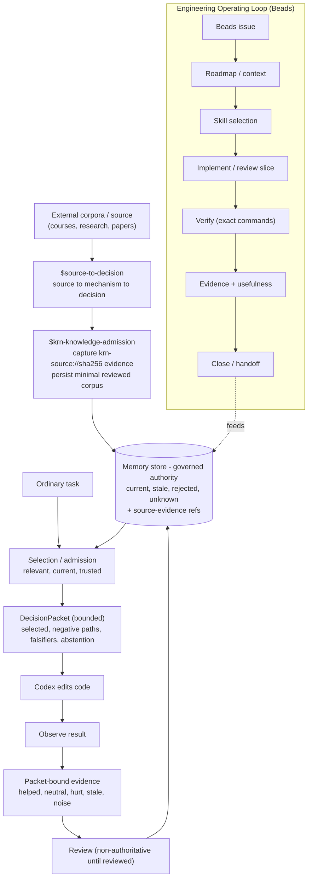

# KRN Work Pipeline

Overview of how work and knowledge move through the KRN Kernel. This is a
navigation aid; the authority for behavior is production code, and the authority
for contract is `AGENTS.md`, `CONVENTIONS.md`, `CONTEXT.md`, and
`KRN_ROADMAP.md`.

## The pipeline

## Reading it

- **Admission (front door).** External specialist material never enters the
  repository raw. `$source-to-decision` distills mechanisms;
  `$krn-knowledge-admission` captures content-addressed evidence
  (`krn-source://sha256/<digest>`) and persists a minimal reviewed corpus as
  governed authority. Captured chunks are evidence, not truth.
- **Rendering.** For an ordinary task, the Memory Core selects what is relevant,
  current, and trusted, then emits a bounded `DecisionPacket`: selected
  standards, negative (rejected or stale) paths, falsifiers, and explicit
  abstention where evidence is weak. Codex edits code from that packet.
- **Feedback.** The result is observed and recorded through the packet-bound
  evidence channel (helped, neutral, hurt, stale, noise). Feedback is
  non-authoritative until reviewed, then updates the store.
- **Engineering loop.** Beads owns task state through issue, context, skill
  selection, implementation or review slice, verification, evidence, and close.
  Its outcomes feed the same memory store.

## Non-goals

This diagram does not define behavior. It cannot approve a decision, promote a
source, or authorize publication. Each arrow maps to a real skill, command, or
contract surface named above; if the diagram and the authority surface disagree,
the authority surface wins.
