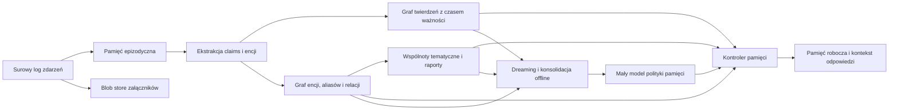

# Jak zbudować wzorcowe memory dla agentów AI

## Konkluzja strategiczna

Tak — jeśli chcecie zbudować memory, które będzie czymś więcej niż „RAG z lepszym UI”, to właśnie **mózg systemu**, czyli polityka zapisu, aktualizacji, selekcji, syntezy i użycia pamięci, jest dziś jednym z głównych determinantów jakości. Najnowsze przeglądy literatury opisują pamięć agentową już nie jako dodatek do promptu, ale jako osobny prymityw architektoniczny, z własnymi formami, funkcjami, dynamiką, kosztami i ryzykami. Równocześnie badania pokazują, że obecne systemy pamięci nadal mają poważne braki: benchmarki są niedoskonałe, koszty utrzymania pamięci bywają pomijane, wyniki zależą od modelu bazowego, a wiele rozwiązań nie radzi sobie dobrze z aktualizacją wiedzy, selektywnym zapominaniem i długohoryzontową spójnością. citeturn0search0turn10search0turn15view0turn15view5

Najkrótsza odpowiedź na Wasze „co myślisz?” brzmi więc: **macie rację co do kierunku, ale nie co do uproszczenia**. W praktyce, gdy model bazowy przekroczy już próg „wystarczająco dobry”, to **architektura pamięci i polityka doboru wzorców** bardzo często robią większą różnicę niż zamiana jednego dobrego modelu na inny. Jednocześnie nie wolno mylić tego z tezą, że model nie ma znaczenia: nadal odpowiada za ekstrakcję, rozumienie konfliktów, syntezę i kontrolę jakości. Literatura z lat 2025–2026 przesuwa środek ciężkości dokładnie w tę stronę: od „storage” do „reflection” i dalej do „experience”, czyli do pamięci, która nie tylko przechowuje, ale uczy się jak pamiętać. citeturn13search7turn16view1turn16view3turn14view6

Jeśli chcecie naprawdę mieć system „wzorcowy”, to jego sercem nie powinien być jeden magiczny trick, tylko **dobrze dobrana hierarchia pamięci**: surowy niezmienny zapis, warstwa epizodyczna, warstwa twierdzeń/faktów, graf encji i relacji, pamięć operacyjna stale widoczna dla agenta, kontroler decydujący co wpuścić do kontekstu, oraz procesy offline, które konsolidują, wykrywają konflikty, odświeżają wspólnoty tematyczne i poprawiają politykę pamięci. To jest dużo bliżej Waszego opisu „żywego braina” niż klasycznego RAG-u. citeturn17view0turn17view1turn17view2turn16view3turn19view1

## Gdzie dziś jest stan memory

Stan badań i praktyki wyraźnie pokazuje, że pole „memory for agents” bardzo przyspieszyło. Nowsze przeglądy opisują pamięć już nie tylko kategoriami short-term/long-term, ale przez **strukturę reprezentacji**, **politykę kontroli** i **dynamikę aktualizacji**. Inny ważny przegląd z 2026 roku porządkuje ewolucję pola jako przejście przez trzy etapy: **Storage**, **Reflection** i **Experience**. To dobrze pasuje do intuicji z Waszego opisu: sam zapis nie wystarcza; potrzebna jest refleksja i abstrahowanie doświadczenia do bardziej trwałych wzorców. citeturn0search0turn13search7turn13search5

Pierwsza silna linia rozwojowa to architektury w stylu **MemGPT / Letta**, które traktują kontekst jako odpowiednik pamięci operacyjnej zarządzanej hierarchicznie. MemGPT wprowadził ideę „virtual context management”, czyli ruchu informacji między szybszymi i wolniejszymi warstwami pamięci. Letta dołożyła do tego praktyczną abstrakcję „memory blocks”: są to strukturalne sekcje kontekstu, które **pozostają widoczne we wszystkich interakcjach i nie wymagają retrievalu**. To jest bardzo użyteczny wzorzec dla Waszej „rdzennej świadomości” agenta: polityki, persony, aktualnego stanu zadania, aktywnych definicji domenowych i ograniczeń bezpieczeństwa nie wolno zostawiać wyłącznie retrieverowi. citeturn17view0turn17view1

Druga linia to **GraphRAG** i pokrewne architektury grafowe. Microsoftowy GraphRAG formalizuje pipeline, który z surowego tekstu wyciąga **encje, relacje i claims**, robi **community detection**, generuje **wielopoziomowe podsumowania wspólnot**, a potem rozdziela tryb odpowiedzi na **local search** i **global search**. Local search łączy ustrukturyzowane dane z grafu z nieustrukturyzowanymi fragmentami dokumentów, więc dobrze nadaje się do pytań o konkretne encje. Global search używa raportów wspólnot i działa map-reduce, więc jest lepszy do pytań przekrojowych, trendów i dużych syntez. To ważne, bo pokazuje, że pamięć nie powinna mieć jednej ścieżki odczytu, tylko kilka trybów odczytu zależnych od typu pytania. citeturn17view2turn17view3turn17view4

Trzecia linia, niezwykle istotna dla Waszego przypadku, to **temporal knowledge graphs**. Zep/Graphiti pokazuje bardzo dojrzały wzorzec: surowe epizody są przechowywane nie-lossy, z nich powstają encje i fakty, a całość jest budowana jako hierarchia **episode → semantic entity/fact → community**. Krytyczne są tu dwa elementy. Po pierwsze, **bi-temporalność**: oddzielenie czasu zdarzenia od czasu ingestu. Po drugie, **invalidacja krawędzi** i śledzenie okresów ważności faktów. To dokładnie odpowiada problemowi, który opisujecie: coś mogło być prawdą w 2011 roku, przestać być prawdą w 2018, a w 2024 wrócić w nowym znaczeniu; pamięć musi umieć to reprezentować bez nadpisywania historii. Graphiti przechowuje też łącza pozwalające iść od semantycznego artefaktu z powrotem do źródłowego epizodu, co jest bardzo ważne dla cytowalności, audytu i rozstrzygania sporów. citeturn16view4turn19view0turn19view1

Czwarta linia to **selektywna pamięć i konsolidacja offline**. Mem0 pokazuje, że selektywna, trwała pamięć potrafi bić pełny kontekst i proste baseline’y pamięciowe, dając przy tym niższy koszt i opóźnienie. LightMem z kolei idzie jeszcze dalej i organizuje pamięć w trzy etapy: sensoryczną, krótkotrwałą i długotrwałą, a konsolidację długotrwałą wykonuje w trybie **sleep-time update**, czyli offline, aby odseparować porządkowanie pamięci od online inference. To jest bardzo mocny argument za Waszym „dreamingiem”: nie jako marketingową metaforą, ale jako konkretną warstwą batchowej konsolidacji, streszczania, deduplikacji, aktualizacji ważności i uczenia kontrolera pamięci. citeturn16view1turn16view2turn16view3

Piąta linia, bardzo świeża, to **kontrola pamięci jako osobny problem decyzyjny**. MemoryAgentBench definiuje cztery kluczowe kompetencje memory agents: accurate retrieval, test-time learning, long-range understanding i selective forgetting, i pokazuje, że obecne metody nie opanowały wszystkich naraz. MemRouter idzie w kierunku taniego, lekkiego routera write-side: zamiast odpalać pełne autoregresyjne zarządzanie pamięcią na każdym kroku, używa małej głowicy klasyfikacyjnej nad embeddingami. Autorzy pokazują poprawę jakości przy dużym spadku opóźnienia write-side. To jest bardzo ważna wskazówka dla Was: warstwa „co zapisać / co zaktualizować / co odrzucić” nie powinna być na stałe zszyta z najdroższym modelem generatywnym. citeturn15view5turn14view6

Najtrudniejsza część pola nie dotyczy dziś samego retrievalu, tylko **aktualizacji, konfliktów, abstention i pamięci wieloosobowej**. LongMemEval mierzy pięć zdolności: extraction, multi-session reasoning, temporal reasoning, knowledge updates i abstention, i pokazuje, że nawet komercyjne asystenty i long-context LLM-y mają duży spadek trafności na długotrwałych interakcjach. STALE pokazuje jeszcze mocniej problem „nieaktualnego wspomnienia”: nawet najlepszy oceniony model osiągnął tam zaledwie 55,2% accuracy. GroupMemBench dokręca śrubę na pamięci grupowej: najlepszy system dochodził do 46,0% średniej trafności, a prosty BM25 potrafił dorównać lub przebić wiele systemów pamięciowych. Innymi słowy: **organizacyjna pamięć wieloźródłowa nadal jest daleka od rozwiązania**, więc jest miejsce na coś naprawdę mocnego. citeturn15view2turn15view3turn3search7

## Dlaczego sam RAG nie wystarczy

Klasyczny RAG był ogromnym krokiem naprzód, ale już oryginalna praca Lewisa i współautorów wskazywała, że **proweniencja i aktualizacja wiedzy** pozostają otwartymi problemami. RAG świetnie rozwiązuje pytanie „jak donieść modelowi właściwe fragmenty”, ale dużo słabiej odpowiada na pytania: „czy ten fragment nadal jest prawdziwy”, „czy nie został już obalony”, „czy to jest głos autorytatywny czy tylko opinia”, „czy pytanie wymaga globalnej syntezy czy lokalnego lookupu”, „czy agent powinien odpowiedzieć czy się wstrzymać”. W praktyce Waszego Astropolis oznacza to dokładnie to, o czym piszesz: ostatni post nie jest prawdą tylko dlatego, że jest ostatni, a najbardziej podobny embedding nie jest prawdą tylko dlatego, że jest podobny. citeturn6academia8turn15view2turn15view5

W przypadku forum, społeczności eksperckiej albo przedsiębiorstwa główny problem nie brzmi „retrieval”, tylko **stan wiedzy w czasie**. Pojęcia dryfują, slang zmienia znaczenie, opinie ekspertów mają nierówną wagę, twierdzenia bywają później prostowane, a część wiedzy jest prawdziwa wyłącznie lokalnie — dla epoki, sprzętu, autora albo konkretnej szkoły praktyki. Zep/Graphiti pokazuje dobrą odpowiedź na ten problem: przechowywanie historii relacji, okresów ważności i invalidacji krawędzi. STALE pokazuje z kolei, że nawet dzisiejsze rozwiązania często potrafią znaleźć update, ale nie potrafią odpowiednio zmienić zachowania, kiedy stary stan jest już nieaktualny. citeturn19view1turn15view3

Dlatego sensowna pamięć dla Astropolis czy dla firmy powinna operować nie na chunkach jako podstawowej jednostce prawdy, ale na **epizodach, twierdzeniach, encjach, relacjach, źródłach i zmianach stanu**. Chunk ma zostać jako nośnik dowodowy i cytatowy. Natomiast logika stanu powinna siedzieć wyżej: w twierdzeniach z ważnością czasową, z identyfikatorem źródła, z oceną wiarygodności, z relacją *supersedes / contradicts / supports*. Właśnie tam powinna działać Wasza warstwa „consensus”, a nie dopiero w samym finalnym generowaniu odpowiedzi. citeturn17view2turn19view0turn11search1

To prowadzi do jeszcze jednej ważnej tezy: **consensus ma sens, ale nie jako stała ścieżka dla każdej odpowiedzi**. Prace o multi-agent debate pokazują poprawę rozumowania i factuality, ale taki mechanizm jest sensowny głównie tam, gdzie wykryliście konflikt, niski poziom wsparcia źródłowego, rozbieżne klastry twierdzeń albo szczególnie wysoką stawkę biznesową. Dla codziennego odczytu pamięci lepsza jest tańsza ścieżka: routing pytania do właściwego trybu pamięci, pobranie dowodów, scoring wiarygodności i ewentualnie abstention. Dla spornych przypadków uruchamiacie adjudykację wieloagentową. citeturn2search2turn12search0turn11search1

Warto też podkreślić jedną bardzo praktyczną rzecz z dokumentacji GraphRAG: w global search można zezwolić modelowi na użycie wiedzy spoza zbioru, ale sama dokumentacja ostrzega, że to może zwiększać halucynacje. Dla pamięci domenowej — forum, poczty, dokumentów firmowych — **domyślnie wyłączyłbym to całkowicie** przy odpowiedziach factual/historycznych. Najpierw pamięć własna i źródła. Świat zewnętrzny tylko wtedy, gdy pytanie jawnie tego wymaga. citeturn17view4

## Zespół badawczy i model operacyjny

Jeżeli chcecie dowieźć coś „wzorcowego”, to nie jest to projekt dla jednego genialnego prompt-engineera. Aktualne przeglądy pokazują, że pamięć agentowa to pełen cykl **write–manage–read**, silnie związany z percepcją, działaniem, oceną i governance. Dodatkowo dochodzą koszty opóźnień, wrażliwość benchmarków, bezpieczeństwo pamięci, prywatność i ryzyko dryfu semantycznego. To oznacza, że minimalny sensowny trzon zespołu musi łączyć badania, systemy, wiedzę domenową i ewaluację. citeturn13search5turn15view0turn15view4turn14view9

| Rola | Główny mandat | Co dowozi |
|---|---|---|
| Lead Memory Architect | architektura pamięci i polityki kontrolne | model warstw, kontrakty danych, reguły write/update/read |
| Applied Research Scientist | ekstrakcja, synteza, conflict handling | pipeline claims, entity resolution, confidence/provenance scoring |
| Knowledge Graph / IR Engineer | reprezentacja i retrieval | graf encji/faktów, hybrydowe wyszukiwanie, query modes |
| Data Platform Engineer | ingest i niezawodność danych | parse’y, kolejki, lake/object store, wersjonowanie, lineage |
| ML Systems Engineer | serving i koszt | routing, cache, batch jobs, profile latency/tokenów |
| Evaluation Lead | benchmarki i red team | gold sety, harness, replay, testy regresji i testy świeżości pamięci |
| Domain Editor / Truth Council | prawda domenowa | adjudykacja sporów, definicje bytów, źródła uprzywilejowane |
| Security & Governance Engineer | prywatność i odporność | access control, retention, memory poisoning, auditability |

Ten projekt potrzebuje też **rady domenowej**, nawet jeśli nieformalnej. W przypadku Astropolis byłoby to kilka osób, które rozumieją historię społeczności, slang, przeszłe spory, ewolucję pojęć i lokalne autorytety. W świecie enterprise to odpowiednik właścicieli procesów, data stewardów i osób od compliance. Powód jest prosty: benchmarki typu GroupMemBench czy STALE pokazują, że problemem nie jest wyłącznie przypomnienie sobie faktu, lecz rozstrzygnięcie który stan, czyja wersja i w jakim czasie obowiązuje. Tego nie da się wiarygodnie ustandaryzować bez ekspertów domenowych. citeturn3search7turn15view3turn15view4

Organizacyjnie polecam model pracy podobny do zespołów IR/search. To nie powinno być „feature team od chatu”, tylko **osobny memory platform team** z własnym backlogiem jakości pamięci. Cotygodniowo: review błędów pamięci, konfliktów i porażek benchmarków. Co dwa tygodnie: refresh gold setu i replay na stabilnym harnessie. Co miesiąc: przegląd polityk retencji, hot spotów kosztowych i zmian schematów encji. Jeśli tego nie oddzielicie organizacyjnie, memory zginie pod presją krótkoterminowych feature’ów. citeturn10search0turn15view4turn14view9

## Architektura referencyjna Memory Core

Najbardziej realna architektura, która pasuje do Waszego opisu i do obecnego stanu badań, to **hybryda append-only substrate + temporal claims graph + controller + offline consolidation**. Nie zaczynałbym od „genialnej odpowiedzi”, tylko od **genialnego stanu pamięci**, z którego odpowiedzi będą mogły być składane różnymi trybami. Takie podejście łączy zalety MemGPT/Letta, GraphRAG, Graphiti/Zep, Mem0 i LightMem, ale bez uzależniania się od jednej szkoły architektonicznej. citeturn17view0turn17view1turn17view2turn16view4turn16view3

W praktyce przełożyłbym Wasze pojęcia na następujące prymitywy systemowe:

| Pojęcie z wizji | Odpowiednik inżynierski |
|---|---|
| ingest | append-only raw event log + parsery + ekstraktory metadanych |
| synteza / destylacja | ekstrakcja twierdzeń, streszczenia sesji, agregacja wspólnot |
| graf encji | encje, aliasy, relacje, węzły społeczności, źródła |
| wykrywanie gapów / duplikatów / anomalii | entity resolution, edge dedup, contradiction detection, stale-state detection |
| heartbeat | cykliczne joby jakości pamięci, refresh wspólnot, repair indeksów, replay benchmarków |
| dreaming | batchowa konsolidacja, streszczanie, propagacja update’ów, uczenie routera |
| consensus | adjudykator konfliktów z dowodami, scoring wiarygodności i ewentualna abstencja |
| świadomość czasu | event_time, ingest_time, validity interval, supersession chain |

Najważniejszą decyzją techniczną byłoby dla mnie rozdzielenie pamięci na kilka klas obiektów. **Surowe epizody** powinny być niezmienne i cytowalne. **Claims/facts** powinny być atomowe, wersjonowane i mieć przedziały ważności. **Encje** powinny mieć aliasy i relacje do źródeł. **Community memory** powinna być budowana nad grafem i służyć do pytań globalnych, nie do twardego ustalania pojedynczego faktu. **Core memory blocks** powinny trzymać tylko to, co agent musi mieć stale „na oczach”: tożsamość, reguły, aktywny task state, priorytety i może kilka najważniejszych aktualnie obowiązujących definicji domenowych. To jest dokładny sens pamięci operacyjnej z Letta i odseparowania lokalnego od globalnego z GraphRAG. citeturn17view1turn17view3turn17view4turn19view1

Druga krytyczna decyzja: **zapisy do grafu powinny być schema-bound, nie swobodnie wygenerowane przez LLM**. W Graphiti autorzy explicite wskazują, że użyli z góry zdefiniowanych zapytań do bazy zamiast LLM-generated database queries, aby zmniejszyć ryzyko halucynacji i utrzymać spójny schemat. To bardzo dobra zasada konstrukcyjna. Model może proponować kandydatów na encje, krawędzie i update’y, ale finalny zapis musi przejść przez walidator schematu, resolver duplikatów i kontroler sprzeczności. citeturn19view1

Trzecia decyzja: **routing pytań**. Nie ma jednej ścieżki retrievalu. Pytanie typu „co to jest dwucalica?” może wymagać co najmniej czterech trybów: lokalnego lookupu encji/slangu, rekonstrukcji historycznej, konsensusu społecznościowego albo narracyjnego streszczenia ewolucji pojęcia. GraphRAG bardzo dobrze uzasadnia rozdzielenie local/global search, a LongMemEval pokazuje, że dochodzi jeszcze warstwa temporal reasoning i knowledge updates. Kontroler pamięci powinien więc najpierw klasyfikować typ pytania, a dopiero potem składać kontekst. citeturn17view3turn17view4turn15view2

Najbardziej interesująca część Waszej wizji to „mały i szybki model neuronowy, dotrenowywany w czasie snu”. Gdybym miał zgadnąć, **najlepsza rola dla takiego modelu to nie generator końcowej odpowiedzi, tylko kontroler pamięci**: admission control, update-vs-insert, routing trybu retrievalu, scoring ryzyka błędu, conflict scoring, decyzja o abstencji i budżetowanie kontekstu. To właśnie te decyzje wykonuje się najczęściej, one dominują koszty write/read path i to one najbardziej zyskują na czymś lekkim, tanim i uczonym na własnych logach. MemRouter pokazuje, że write-side routing da się odseparować od answer backbone i zrealizować lekkim modelem; RSCB-MC pokazuje, że właściwe pytanie brzmi nie „które wspomnienie jest najbardziej podobne?”, tylko „czy jakiekolwiek wspomnienie jest wystarczająco bezpieczne, by wpływać na trajektorię odpowiedzi?”. citeturn14view6turn12search0

Dla załączników i obrazów poszedłbym ścieżką ostrożną. Na starcie każdy obraz lub plik powinien wejść do **blob/object store** z dobrym linkowaniem do epizodów, wątków, autorów i czasu. Natomiast pełną pamięć multimodalną — semantyczne wyciąganie wiedzy z obrazów, wykresów, slajdów czy astrofotografii — wdrażałbym dopiero po ustabilizowaniu tekstowego Memory Core. Badania multimodal memory rosną szybko, ale dla Waszego typu zastosowania największy zwrot z inwestycji nadal da tekst, czas, proweniencja i konflikt handling. citeturn9search8turn9search14

## Plan wdrożenia realistycznego

Najrozsądniejszy plan to nie „budujemy mózg”, tylko „budujemy **kolejno** podłoże, stan pamięci, kontroler i mechanizmy regeneracji”. Zbyt wczesne wrzucenie wszystkiego do jednego worka kończy się zwykle drogim systemem, którego nie da się zdebugować. Benchmarki z 2025–2026 pokazują, że ewaluacja pamięci jest sama w sobie trudna, a wiele systemów przegrywa nie z powodu braku retrievalu, tylko przez złą politykę zapisu, konfliktów albo oceny. citeturn15view0turn15view5turn15view3

| Faza | Cel | Najważniejsze artefakty |
|---|---|---|
| Fundament | ustalić kontrakty danych i prawdy | schema encji, schema claims, event model, provenance model, baseline harness |
| Ingest i raw substrate | mieć niezmienny, audytowalny zapis | parsowanie forów/maili/dokumentów, wersjonowanie, metadane czasu, obiektowy storage |
| Memory state | wyjść poza chunky | pamięć epizodyczna, claims, graf encji/aliasów, podstawowa invalidacja stanów |
| Query brain | odpowiadać różnymi trybami | router pytań, local/global/temporal/consensus modes, budżetowanie kontekstu |
| Dreaming i heartbeat | utrzymywać jakość w czasie | nightly jobs, dedup, stale-state repair, refresh wspólnot, trening małego routera |
| Governance i hardening | przygotować produkcję | RBAC, retencja, audit logi, testy poisoning/MCFA, release gates benchmarkowe |

Gdybym to układał na realny harmonogram, zrobiłbym tak. **Pierwsze 6–8 tygodni**: audyt danych, zdefiniowanie event schema, przygotowanie parserów i gold setu pytań insiderskich. **Kolejne 8–10 tygodni**: append-only substrate, podstawowe entity resolution, proste retrieval baseline i pierwsze dashboardy jakości. **Następne 10–12 tygodni**: claims graph z czasem ważności, invalidacją, źródłami i pierwszymi trybami query routing. **Dopiero potem**: dreaming, uczenie małego routera, warstwa consensus/adjudication i pełne benchmarki regresyjne. Taka kolejność minimalizuje ryzyko zbudowania „ładnej odpowiedzi z brzydkiego stanu”. citeturn19view1turn16view3turn14view6

Stos technologiczny może być całkiem pragmatyczny. Dla surowego korpusu: object store plus relacyjna baza metadanych. Dla full-text i BM25: OpenSearch lub analog. Dla wektorów: pgvector, Qdrant albo Weaviate. Dla grafu: Neo4j, Memgraph albo własny storage nad Parquet/Arrow, jeśli chcecie optimize’ować koszty i batch. Dla orkiestracji batchy: Temporal, Airflow albo Dagster. Dla eksploatacji online: osobny memory controller service, nie zszyty z frontendem agenta. To nie jest kwestia „jedynie słusznego stacku”, tylko bardzo pilnego rozdzielenia odpowiedzialności: storage, indexing, reasoning, governance. citeturn17view2turn19view1turn14view6

Najważniejsze jest jednak coś innego: **nie zaczynajcie od całego świata**. Jeśli celem jest Astropolis-like memory albo firmowa pamięć organizacyjna, zacznijcie od jednego wycinka, gdzie prawda jest trudna i zmienna, ale możliwa do ręcznego osądzenia. Dla forum może to być słownik lokalnych pojęć, historia sporów sprzętowych albo ewolucja praktyk obserwacyjnych. Dla firmy: jeden proces, jeden zespół, jedna domena pojęć. W przeciwnym razie nie zbudujecie wiarygodnej pętli uczenia jakości pamięci. citeturn3search7turn15view3turn15view5

## Jak mierzyć jakość i gdzie są największe ryzyka

Dobre memory nie powinno być mierzone wyłącznie „czy odpowiedź brzmi sensownie”. Dzisiejsze benchmarki pokazują, że trzeba rozdzielać co najmniej pięć osi: **retrieval correctness**, **temporal correctness**, **knowledge update handling**, **abstention quality** i **koszt systemowy**. LongMemEval daje bardzo dobry punkt wyjścia dla pamięci konwersacyjnej; MemoryAgentBench dodaje accurate retrieval, test-time learning, long-range understanding i selective forgetting; MemBench naciska też na efektywność, pojemność i różne poziomy pamięci. Jeśli chcecie być wzorcem dla innych, musicie mieć własny harness, który łączy te osie w jeden release gate. citeturn15view2turn15view5turn3search3

Praktycznie mierzyłbym to tak: po pierwsze, **source-grounded factuality**, czyli czy każda mocna teza ma poprawne źródło i czy źródło faktycznie wspiera treść. Po drugie, **temporal fidelity**, czyli czy system odpowiada stanem właściwym dla czasu pytania i potrafi odrzucić nieaktualne założenie. Po trzecie, **conflict behavior**, czyli czy przy sporze umie podać wersje konkurencyjne, zważyć je albo się wstrzymać. Po czwarte, **memory economy**, czyli ile kosztuje zapis, utrzymanie i odczyt. Po piąte, **operational safety**, czyli czy pamięć nie steruje agentem wbrew instrukcjom. STALE, MMA i MemConflict bardzo dobrze pokazują, że konflikt, nieaktualność i ocena wiarygodności to dziś centralny problem, a nie edge case. citeturn15view3turn11search1turn11search17

Ryzyka są trzy. Pierwsze to **dryf semantyczny i korupcja pamięci**: wielokrotne streszczanie i nadpisywanie potrafi stopniowo zniszczyć wiedzę. Drugie to **memory poisoning / control flow hijack**: najnowsze prace o MCFA pokazują, że pamięć może sterować narzędziami i zachowaniem agenta w sposób trwały i niepożądany; badacze wykazali wysoką podatność testowanych systemów. Trzecie to **wycieki i błędy governance**: w pamięci długoterminowej bardzo łatwo utrwalić dane wrażliwe albo wiedzę, która nie powinna być globalnie dostępna. Dlatego governance nie może być dodatkiem — musi być integralnym subsystemem z access control, consistency verification i politykami konsolidacji. citeturn15view4turn14view9turn13search11

Moja końcowa ocena jest więc bardzo prosta. Wasza intuicja jest mocna i zgodna z kierunkiem badań: **przyszłość memory nie leży w lepszym fetchowaniu chunków, tylko w budowaniu temporalnej, wielowarstwowej, samokorygującej się struktury pamięci z kontrolą write/read, proweniencją i mechanizmami odświeżania offline**. Jeśli zrobicie to dobrze, to nie będzie „kolejny memory system”, tylko referencyjna architektura klasy Memory Core. Ale warunek jest jeden: musicie myśleć o tym jak o osobnej dziedzinie systemowej — bliżej search/knowledge systems niż bliżej prompt engineeringu. citeturn10search0turn13search7turn16view3turn19view1
