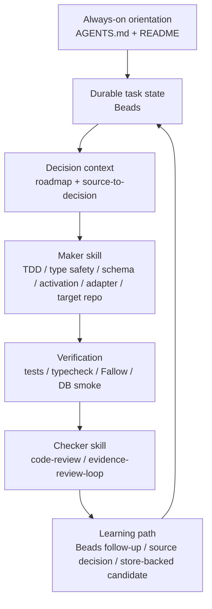
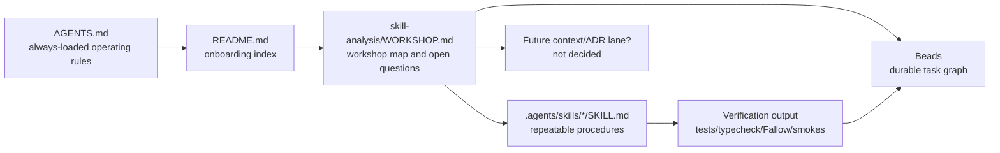

# Skill System Workshop

This is the thinking surface for deciding whether KRN's skills are actually
useful. It is deliberately separate from the runtime product roadmap.

## What We Are Optimizing

The target is not "more skills" or "prettier markdown." The target is a repeatable
engineering operating system where an agent can answer:

- What mode am I in?
- Which artifact tells me the current decision?
- Which skill changes my behavior right now?
- What is the stop condition?
- Who checks the work?
- Where does the learned result go?

If a skill does not change one of those answers, it is probably decoration.

## External Patterns

Matt Pocock's pattern:

- Keep a small vocabulary of reusable engineering moves.
- Use user-invoked router/orchestrator skills for broad flows.
- Use model-invoked discipline skills for repeated work like TDD, code review,
  domain modeling, debugging, and codebase design.
- Write decisions and vocabulary down as the work happens, so the next agent is
  not reconstructing the mental model from chat history.
- Prefer vertical slices and red/green feedback loops over broad speculative
  plans.

Claude/Vercel/progressive-disclosure pattern:

- Keep always-needed routing short and easy to load.
- Put deeper procedural knowledge behind skills.
- Put branch-specific details behind references.
- Use skills when they make a repeated workflow more predictable, not when they
  merely store prose.

Loop-engineering pattern:

- Durable state outside the conversation.
- Skills for repeated behavior.
- Worktrees/PRs for isolation when risk warrants it.
- Maker/checker separation.
- Explicit stop conditions and fail-loud behavior.

Sources to keep in view while discussing this:

- Matt Pocock skills repo: `https://github.com/mattpocock/skills`
- Matt domain-modeling skill: `https://github.com/mattpocock/skills/blob/main/skills/engineering/domain-modeling/SKILL.md`
- Claude Skills docs: `https://platform.claude.com/docs/en/agents-and-tools/agent-skills/overview`
- Claude Skills best practices: `https://platform.claude.com/docs/en/agents-and-tools/agent-skills/best-practices`
- Vercel AGENTS.md eval: `https://vercel.com/blog/agents-md-outperforms-skills-in-our-agent-evals`
- Addy Osmani loop engineering: `https://addyosmani.com/blog/loop-engineering/`
- Cobus Greyling loop-engineering repo:
  `https://github.com/cobusgreyling/loop-engineering`

## KRN Layer Map

This map shows the current intended loop. The open question is whether each box
is backed by a skill that really changes agent behavior.

## Artifact Map

This is the core correction: a context/ADR lane is not rejected because "docs
are bad." It is undecided because we need to choose the right shape. Matt's
lesson is that vocabulary and decisions must become visible artifacts; the open
KRN question is where that artifact lives so it improves agent behavior without
becoming a junk drawer.

## Current KRN Skill Roles

| Layer | Current Skills | Question |
|---|---|---|
| Routing and state | `beads`, `handoff-compact` | Is routing visible enough without an `ask-krn` router? |
| Source decisions | `source-to-decision` | Is this too broad, or is it the right single gate? |
| Maker implementation | `tdd`, `typescript-type-safety`, `brain-store-schema`, `activation-engine`, `codex-adapter-plan`, `target-repo-testing` | Do these create tight loops, or are some just policy reminders? |
| Checker | `code-review`, `evidence-review-loop` | Is the checker independent enough from maker work? |
| Language/design | `domain-modeling`, `codebase-design` | Do these produce durable decisions, or only advice? |

## Skill Quality Rubric

Use this rubric before adding, deleting, or rewriting a skill:

| Question | Good Answer | Bad Answer |
|---|---|---|
| Trigger | A distinct user phrase or task condition activates it. | It sounds generally useful. |
| Loop | It changes the process the agent follows. | It stores advice the agent already knows. |
| Artifact | It produces a decision, issue, test, report, patch, or evidence row. | It produces vibes or a long summary. |
| Stop | It has a checkable endpoint. | "When it feels done." |
| Checker | It names how the result is verified or reviewed. | The maker judges itself. |
| Memory | Useful output lands in Beads, source decision, ADR/context candidate, or store-backed path. | Useful output stays in chat. |
| Load | It earns its description/context cost. | It is another always-visible no-op. |

This is the real "sexy" test: the skill should make a repeated move sharper,
not just make the catalog bigger.

## Matt Skill Pressure Test

| Matt Skill | KRN Interpretation | Current Thought |
|---|---|---|
| `ask-matt` | Router over skills | Maybe useful as `ask-krn` if operator/agent confusion repeats. |
| `grill-with-docs` | Interview that updates vocabulary and ADRs inline | We need the mechanism. The artifact target is still open: one context/decision file, Beads, roadmap, or store candidate. |
| `to-spec` | Conversation -> spec | Potentially useful if Beads issues are too thin. Avoid a second planning surface unless specs become real input to work. |
| `to-tickets` | Spec/plan -> tracer-bullet tickets | Mostly Beads, but our Beads skill may need stronger tracer-bullet language. |
| `triage` | Issue state machine | Beads may cover state, but not necessarily quality of agent-ready issue briefs. |
| `wayfinder` | Map foggy large work into investigation tickets | Very relevant to big KRN goals. Could become Beads wayfinding discipline, not necessarily a new skill. |
| `diagnosing-bugs` | Build tight red loop before hypotheses | Real gap. KRN has TDD but not diagnosis discipline. |
| `prototype` | Throwaway model/UI exploration | Not current unless KRN starts product UX or state-model experiments. |
| `research` | High-trust source investigation | Covered partly by `source-to-decision`, but research legwork vs decision capture may need separation. |
| `implement` | Execute ticket/spec | Probably not a KRN skill; Codex already implements. |
| `resolving-merge-conflicts` | Git conflict procedure | Useful generic skill, not KRN-specific. |
| `setup-matt-pocock-skills` | Repo setup for skills | One-time setup; not needed after KRN defines its own system. |

## Current Suspicions

- `source-to-decision` may be doing too much: research intake, source mapping,
  usefulness closure, and continuous knowledge gate. It is powerful, but it may
  be a place where the agent gets overloaded.
- `beads` may need explicit submodes instead of more separate skills:
  `triage`, `tracer-bullets`, and `wayfinding`.
- `domain-modeling` currently says what not to create, but may not give enough
  positive structure for a shared vocabulary/decision artifact.
- `evidence-review-loop` is a strong checker, but it should be paired
  deliberately after maker skills instead of used as a final-answer checklist.
- `diagnosing-bugs` is the clearest missing repeated loop.

## Open Decisions

1. Do we want a KRN equivalent of `CONTEXT.md`?
   - Candidate: one compact `KRN_CONTEXT.md` for vocabulary and current accepted
     operating decisions.
   - Risk: it becomes runtime memory or duplicates roadmap.
   - Useful if: agents repeatedly lose the same vocabulary/decision context.
   - Matt mechanism: resolve a term once, write it down immediately, and force
     future agents to use that language.

2. Do we want ADRs?
   - Candidate: one lightweight `docs/adr/` or `decisions/` lane.
   - Risk: scattered decision forest.
   - Useful if: decisions are hard to reverse, surprising, and repeatedly
     rediscovered.
   - Matt mechanism: ADRs are tiny and lazy, not a ceremony. The value is
     preventing future agents from "fixing" deliberate decisions.

3. Do we add `diagnosing-bugs`?
   - Candidate: yes, because it is a distinct loop from TDD.
   - Risk: overlap with TDD if too broad.
   - Useful if: it requires a red-capable repro before hypotheses.

4. Do we add `ask-krn`?
   - Candidate: user-invoked router over KRN skills.
   - Risk: it duplicates README if not used.
   - Useful if: it names when to use each skill and asks one clarifying question
     only when routing is ambiguous.

5. Do we strengthen Beads instead of adding `to-spec`, `to-tickets`,
   `triage`, and `wayfinder`?
   - Candidate: yes, because Beads is already durable task state.
   - Risk: one overloaded skill.
   - Useful if: Beads gets explicit modes: triage, tracer bullets, wayfinding.

## Next Useful Workshop Step

Pick one question and turn it into a concrete artifact experiment. The strongest
first candidate is `diagnosing-bugs`, because it is a clearly separate repeated
loop with a strong stop condition: no red-capable repro, no fix.
