# Skill Graph

Generated from current `.agents/skills/*/SKILL.md` and optional local Matt Pocock skill clone.
This graph is a navigation aid, not a taxonomy. It groups skills by likely loop
role so the unclear parts of the system are visible.

```mermaid
flowchart LR
  AlwaysOn["Always-on routing\nAGENTS.md / README"]
  Durable["Durable state\nBeads / issue graph"]
  Decisions["Decision artifacts\nsource decisions / context / ADR candidates"]
  Verify["Verification\ntests / typecheck / Fallow / smokes"]
  AlwaysOn --> Durable --> Decisions
  subgraph KRN["KRN"]
    subgraph KRN_checker["checker"]
      KRN_code_review["code-review"]
      KRN_target_repo_testing["target-repo-testing"]
    end
    subgraph KRN_decision["decision"]
      KRN_domain_modeling["domain-modeling"]
      KRN_source_to_decision["source-to-decision"]
    end
    subgraph KRN_maker["maker"]
      KRN_diagnosing_bugs["diagnosing-bugs"]
      KRN_krn_implementation["krn-implementation"]
    end
    subgraph KRN_router["router"]
      KRN_beads["beads"]
    end
  end
  subgraph MATT["Matt Pocock"]
    subgraph MATT_checker["checker"]
      MATT_code_review["code-review"]
    end
    subgraph MATT_decision["decision"]
      MATT_codebase_design["codebase-design"]
      MATT_domain_modeling["domain-modeling"]
      MATT_grill_with_docs["grill-with-docs"]
      MATT_improve_codebase_architecture["improve-codebase-architecture"]
      MATT_research["research"]
      MATT_to_spec["to-spec"]
    end
    subgraph MATT_maker["maker"]
      MATT_diagnosing_bugs["diagnosing-bugs"]
      MATT_implement["implement"]
      MATT_prototype["prototype"]
      MATT_resolving_merge_conflicts["resolving-merge-conflicts"]
      MATT_tdd["tdd"]
    end
    subgraph MATT_router["router"]
      MATT_ask_matt["ask-matt"]
      MATT_setup_matt_pocock_skills["setup-matt-pocock-skills"]
      MATT_to_tickets["to-tickets"]
      MATT_triage["triage"]
      MATT_wayfinder["wayfinder"]
    end
  end
  Decisions --> KRN_decision
  KRN_decision --> KRN_maker
  KRN_maker --> Verify --> KRN_checker
  KRN_checker --> Durable
  MATT_decision -. context pattern .-> Decisions
  Decisions -. comparison .-> MATT_maker
  MATT_checker -. comparison .-> Verify
  MATT_router -. pattern .-> AlwaysOn
```

